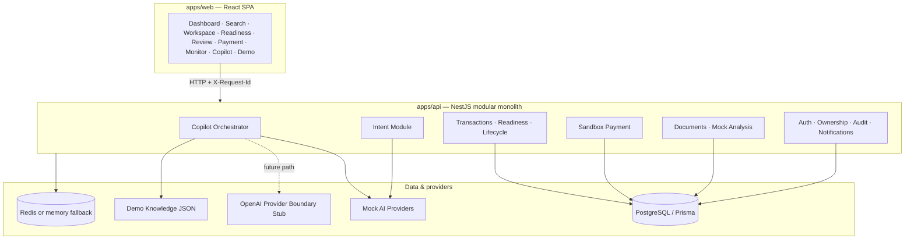
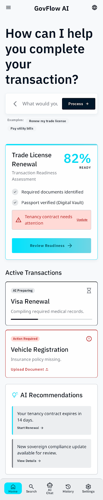
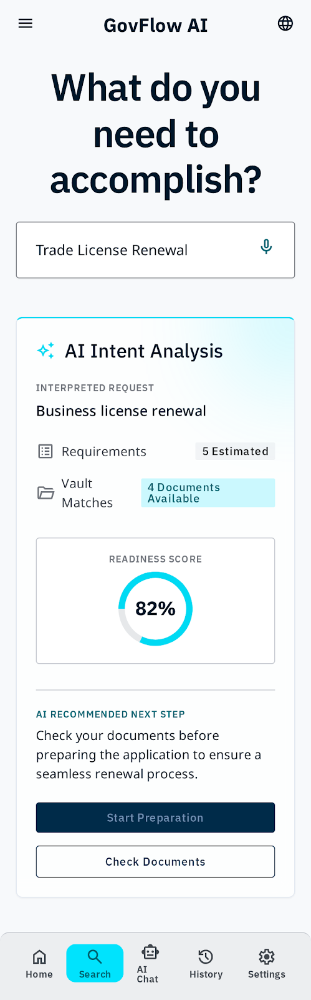
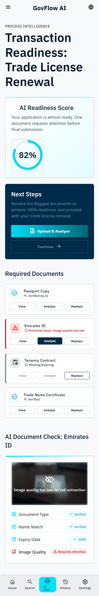
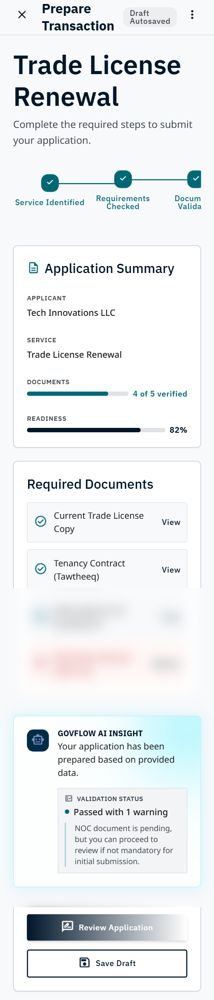
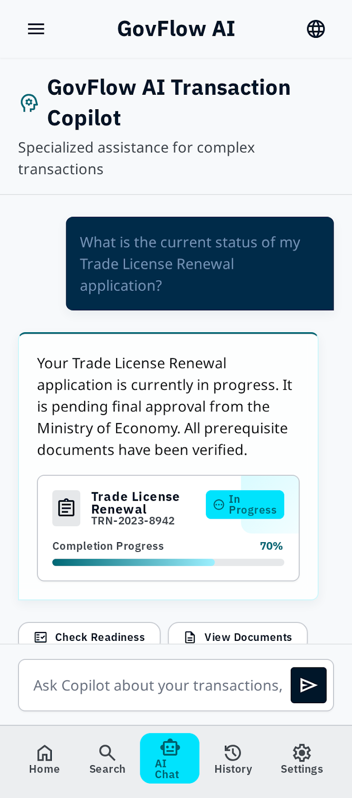
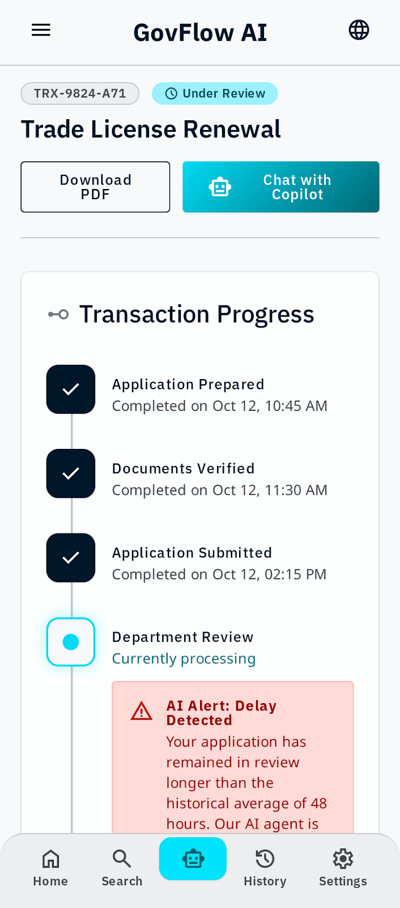

# GovFlow AI — UAE AI Government Assistant

**AI-powered government service discovery, document readiness, and digital transaction workflows — delivered as a council-ready sandbox demonstration.**

[](https://github.com/ehteshamalvi/uae-ai-government-assistant/actions/workflows/ci.yml)
[](https://nodejs.org/)
[](docs/IMPLEMENTATION-PLAN.md)
[](.env.example)
[](docs/COUNCIL-DEMO.md)

> **Disclaimer:** This project is an **independent technical demonstration / sandbox** and is **not** an official UAE government system. It is **not affiliated** with TAMM, DubaiNow, Abu Dhabi Government, Dubai Government, or any other government entity. It does **not** connect to real government APIs, does **not** use UAE Pass, and does **not** process real payments.

---

## Overview

GovFlow AI demonstrates how artificial intelligence can improve **UAE-style digital government service journeys** — from understanding a citizen or business request, through requirement and document readiness, to guided transaction preparation, sandbox payment, submission monitoring, and completion.

The platform is built as a **modular monolith**: a React web application and a NestJS API, with deterministic backend services that enforce readiness, ownership, payment, and lifecycle rules, while AI components recommend and explain.

**Architectural principle:**

```text
AI recommends → Deterministic services enforce → User confirms → Workflow executes
```

---

## Why this project matters

Digital government programmes increasingly combine portals, document requirements, fees, and multi-step approvals. Users often struggle to:

- identify the correct service from natural language
- understand missing requirements and document issues
- know what to do next in a long transaction lifecycle
- trust AI guidance without uncontrolled system actions

GovFlow AI demonstrates a practical pattern for the Emirates Council for AI and Digital Transactions evaluation context:

| Challenge | Demonstration approach |
|-----------|------------------------|
| Chatbots invent policy | Demo knowledge + relevance thresholds; refuse low-confidence answers |
| Portals lack guidance | Context-aware Copilot tied to live transaction state |
| AI must not “run government” | Allowlisted suggestions only; payments/submissions require user confirmation and backend enforcement |
| Demos must be honest | Sandbox labels, mock AI default, no fake government affiliation |

---

## Core capabilities (implemented)

| Capability | Description |
|------------|-------------|
| **AI Government Copilot** | Context-aware assistant over transaction readiness, documents, payment, and next steps |
| **Intelligent service discovery** | Catalog-backed services with intent-driven identification |
| **Intent analysis** | Natural-language intent → service mapping via `MockIntentProvider` |
| **Document readiness analysis** | Mock document analysis labels + deterministic readiness scoring |
| **Transaction workspace** | Fields, documents, steps, and next-action guidance |
| **Transaction lifecycle** | State machine from preparation through sandbox submit, process, and complete |
| **Requirement evaluation** | Catalog requirements vs transaction state |
| **Transaction insights** | Stored monitoring/readiness insights (deterministic/derived summaries in the sandbox, plus AI-provider architecture for explanations) |
| **Digital payment sandbox** | Fee quote + simulated SUCCESS/FAILURE — no card/CVV collection |
| **Notifications** | In-app notifications for payment, submission, and status events |
| **Audit logging** | Workflow events (payment, submit, sandbox advance/reset, etc.) |
| **Role-based architecture** | Users, roles, and permissions in Prisma; ownership and admin checks on transactions (not fine-grained permission middleware on every action) |
| **Arabic and English** | Locale switching with RTL support |
| **Council Demo Mode** | `/demo` guided flow, progress indicator, reset (when `DEMO_MODE=true`) |
| **AI provider abstraction** | `AI_PROVIDER=mock` (functional default); OpenAI provider boundary (architectural stub — live OpenAI API calls are not currently enabled) |
| **Mock AI providers** | Intent, document analysis, and Copilot — currently functional sandbox providers (no OpenAI key required) |
| **Security hardening** | Helmet, CORS allowlist, rate limiting, validation, request IDs, safe errors |

---

## AI architecture

```text
User
  ↓
Web Application (React SPA)
  ↓
Government AI Copilot / Intent APIs
  ↓
Query classification · Context builder
  ↓
AI Provider — Mock (functional default) or OpenAI boundary (stub)
  ↓
Demo knowledge retrieval + service / transaction data
  ↓
Deterministic transaction, readiness, payment & workflow services
  ↓
Allowlisted next-step guidance (user confirms; backend executes)
```

### What is real vs sandbox

| Component | Status |
|-----------|--------|
| Copilot orchestrator, context builder, query classifier | **Implemented** |
| Local keyword knowledge retriever (`demo-knowledge.json`) | **Implemented** (demo RAG — not vector embeddings) |
| `MockCopilotAIProvider` / mock intent / mock document analysis | **Implemented** — currently functional / default sandbox providers |
| `OpenAICopilotProvider` | **Architectural boundary / stub** — live OpenAI API calls are **not** currently enabled (`generate()` rejects; future integration path) |
| Readiness engine, state machine, ownership, fees | **Deterministic backend** |
| Payment & submission | **Sandbox providers only** |
| LangGraph / autonomous agents / production vector DB | **Not implemented** (future roadmap) |

---

## Digital transaction lifecycle

Demonstrated end-to-end path:

1. **Service selection** — AI Intent Search or catalog
2. **Requirements** — fields and documents from the service catalog
3. **Document readiness** — analysis labels + readiness score breakdown
4. **Transaction creation / preparation** — workspace with live API data
5. **Lifecycle states** — e.g. PREPARING → READY_FOR_REVIEW → PAYMENT_PENDING → SUBMITTED → PROCESSING → COMPLETED
6. **Final review** — backend eligibility (`READY_FOR_REVIEW` / `NOT_READY` / `BLOCKED`); user confirmation required
7. **Payment sandbox** — visible sandbox payment; no real money
8. **Sandbox submission & monitoring** — demo submission reference; timeline from database
9. **Completion / next action** — Sandbox Advance (demo only) → Completed; Reset Demo for reviewers

Seeded demo transaction: **`TRX-9824-A71`**

Council path: see [docs/COUNCIL-DEMO.md](docs/COUNCIL-DEMO.md) and [docs/COUNCIL-DEMO-VERIFICATION.md](docs/COUNCIL-DEMO-VERIFICATION.md).

---

## AI safety and governance

- **Allowlisted Copilot actions** — navigation/suggestion codes only; no arbitrary URLs; AI does not execute pay, submit, delete, or status change
- **Controlled orchestration** — classify → build context → retrieve knowledge → provider → validate response
- **Audit logging** — sensitive workflow events recorded
- **Provider abstraction** — mock providers are live today; OpenAI remains an architectural stub so future live integration can swap without rewriting domain services
- **Sandbox payment provider** — simulated outcomes only
- **Demo Mode gates** — sandbox advance/reset disabled in production-style configuration
- **Separation of concerns** — AI recommends; deterministic services enforce; user confirms; workflow executes
- **Guardrails** — Copilot must not claim real government submission, affiliation, or legal advice

Details: [docs/SECURITY.md](docs/SECURITY.md) · [docs/AI-ARCHITECTURE.md](docs/AI-ARCHITECTURE.md)

---

## Technology stack

| Layer | Technologies (as in repository) |
|-------|----------------------------------|
| **Web** | React 19, Vite 8, TypeScript, Tailwind CSS 4, TanStack Query, Zustand, React Router |
| **API** | NestJS 11, Prisma 6, PostgreSQL, Redis (ioredis + in-memory fallback), Helmet, Throttler |
| **AI** | Mock providers (functional default); OpenAI provider boundary/stub (live calls not enabled); local demo knowledge retrieval |
| **Quality** | ESLint, Prettier, Jest (API), GitHub Actions CI |
| **Ops** | Docker Compose (Postgres + Redis), embedded Postgres fallback script |

---

## Architecture diagram



---

## Repository structure

```text
uae-ai-government-assistant/
├── apps/
│   ├── api/                 # NestJS API, Prisma, knowledge, providers
│   └── web/                 # React + Vite SPA
├── docs/                    # Architecture, AI, API, DB, Security, Council demo
├── stitch/original/         # Archived Stitch UI references + screen previews
├── .github/workflows/       # CI (lint, tests, builds)
├── docker-compose.yml       # Postgres + Redis (optional local infra)
├── .env.example             # Documented environment template (no secrets)
└── README.md
```

---

## Security

Summary of [docs/SECURITY.md](docs/SECURITY.md):

- Secrets are **environment-based** (`.env` locally; never committed)
- `.env`, uploads, `.data/`, `dist/`, keys, and logs are **gitignored**
- Sandbox credentials documented below are **intentional non-production** values
- CORS via `WEB_ORIGIN` (required in production; no wildcard with credentials)
- Helmet, rate limiting, DTO validation, request correlation IDs, ownership checks
- Production defaults: `DEMO_MODE` off by default; sandbox advance/reset forbidden

**Do not commit production credentials, API keys, or private certificates.**

---

## Testing and quality

Verified local / CI baseline for Phase 6:

| Check | Result |
|-------|--------|
| API unit tests | **59 passed** (10 suites) |
| API lint | Pass |
| Web lint | Pass |
| API build | Pass |
| Web build | Pass |

```bash
npm run db:generate
npm run lint
npm test -w apps/api
npm run build -w apps/api
npm run build -w apps/web
```

CI (`.github/workflows/ci.yml`): `npm install` → Prisma generate → lint → API tests → API/web builds.
**Does not require** OpenAI API key, Docker runtime, or external government APIs.

---

## Local development

### Prerequisites

- Node.js **20+** (`engines.node` in package.json: `>=20`)
- Docker Desktop **or** embedded Postgres (`npm run db:embedded`)
- Redis optional (API falls back to in-memory)

### Install

```bash
npm install
cp .env.example apps/api/.env
# Optional: cp apps/web/.env.example apps/web/.env
```

### Environment (see `.env.example`)

| Variable | Notes |
|----------|--------|
| `DATABASE_URL` | PostgreSQL connection |
| `REDIS_URL` | Optional |
| `WEB_ORIGIN` | Allowed CORS origin(s); required in production |
| `AI_PROVIDER` | Default `mock` (functional). `openai` selects the architectural stub only — live OpenAI calls are not enabled |
| `OPENAI_API_KEY` | Reserved for a future live OpenAI path; leave empty for demos |
| `DEMO_MODE` | `true` for council demo controls (default non-production) |
| `PORT` / `NODE_ENV` | API port and environment |

### Database

```bash
npm run docker:up          # optional: Postgres + Redis
# OR keep this running:
npm run db:embedded

npm run db:generate
npm run db:migrate
npm run db:seed
```

### Run

```bash
npm run dev                # API + web concurrently
# or:
npm run dev:api
npm run dev:web
```

| Surface | URL |
|---------|-----|
| Web | http://localhost:5173 |
| API | http://localhost:3001/api |
| Health | http://localhost:3001/api/health |
| Council Demo | http://localhost:5173/demo |

### Docker

`docker-compose.yml` starts **Postgres** and **Redis** only. Day-to-day development can use embedded Postgres + Redis memory fallback without Docker.

---

## Sandbox Demo

**Non-production credentials** (seeded intentionally for evaluators):

| Item | Value |
|------|--------|
| Email | `khalid.demo@govflow.ai` |
| Password | `DemoPass123!` (seeded hash; login UI is a placeholder) |
| Demo transaction | `TRX-9824-A71` |
| Demo entry | `/demo` |
| AI default | `AI_PROVIDER=mock` |

**Authentication (current):** demo identity via the `X-Demo-User-Email` header (defaults to the seeded demo user). This is **not** UAE Pass and **not** production JWT login.

Reset (requires `DEMO_MODE=true`):

- UI: **Reset Demo** on `/demo`
- API: `POST /api/transactions/TRX-9824-A71/sandbox/reset`

These credentials are **sandbox-only**. They are not production secrets.

---

## UI references (Stitch archive)

Design and layout references live under `stitch/original/` (visual QA archives — not live app screenshots):

| Screen | Preview |
|--------|---------|
| Dashboard |  |
| Intent Search |  |
| Readiness |  |
| Workspace |  |
| Copilot |  |
| Monitor |  |

Canonical tokens: `stitch/original/govflow_ai/DESIGN.md`.

---

## Documentation

| Document | Link |
|----------|------|
| Architecture | [docs/ARCHITECTURE.md](docs/ARCHITECTURE.md) |
| AI Architecture | [docs/AI-ARCHITECTURE.md](docs/AI-ARCHITECTURE.md) |
| API | [docs/API.md](docs/API.md) |
| Database | [docs/DATABASE.md](docs/DATABASE.md) |
| Security | [docs/SECURITY.md](docs/SECURITY.md) |
| Council Demo | [docs/COUNCIL-DEMO.md](docs/COUNCIL-DEMO.md) |
| Council Demo Verification | [docs/COUNCIL-DEMO-VERIFICATION.md](docs/COUNCIL-DEMO-VERIFICATION.md) |
| Implementation Plan | [docs/IMPLEMENTATION-PLAN.md](docs/IMPLEMENTATION-PLAN.md) |

---

## Project status

| Area | Status |
|------|--------|
| Phases 1–6 (foundation → council hardening) | **Implemented** |
| Full sandbox transaction journey + Copilot | **Implemented** |
| Mock AI providers + demo knowledge | **Implemented** |
| Security headers, CORS, throttling, demo gates | **Implemented** |
| OpenAI live API calls | **Not enabled** (provider exists as architectural stub only) |
| Real UAE government APIs | **Not implemented** |
| UAE Pass | **Not implemented** |
| Real payment gateway / OCR / messaging | **Not implemented** |
| Production LangGraph / vector DB agents | **Not implemented** |

---

## Roadmap (from implementation plan)

**Deferred / Phase 7+** (explicitly out of current scope):

- Production OpenAI integration path as a first-class runtime
- Real government system integrations
- UAE Pass authentication
- Real payment gateway
- Real OCR
- Production vector database / embedding retrieval
- Production LangGraph orchestration
- Autonomous agents
- WhatsApp / SMS / email automation
- Optional Copilot SSE streaming (noted as deferred in Phase 6)

---

## Council evaluation highlights

This repository is intended to demonstrate:

1. **AI engineering** — intent, Copilot orchestration, provider boundaries, demo knowledge retrieval
2. **Government-service workflow design** — catalog → requirements → readiness → review → pay → submit → monitor
3. **Digital transaction architecture** — explicit state machine and sandbox lifecycle
4. **Secure AI orchestration** — allowlists, validation, rate limits, request IDs, ownership
5. **Document intelligence (sandbox)** — mock analysis labels feeding deterministic readiness
6. **Multilingual UX** — English / Arabic with RTL
7. **Backend architecture** — NestJS modular monolith, Prisma schema, Redis abstraction
8. **Auditability** — audit log + notifications for key events
9. **Scalable provider boundaries** — swap AI/payment/OCR implementations without rewriting the domain core

---

## Disclaimer

**This project is an independent technical demonstration/sandbox and is not an official UAE government system.**

No real government systems are connected. No real payments are processed. No UAE Pass integration is present. No official government approvals, partnerships, or certifications are claimed.

---

## Branching

| Branch | Role |
|--------|------|
| `main` | Protected, stable, default |
| `dev` | Active development |

Future changes should land on **`dev`** via pull requests — do not push directly to `main`.
